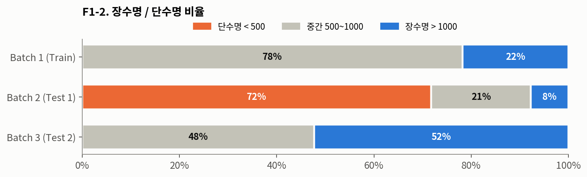
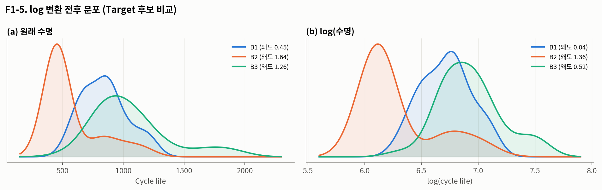
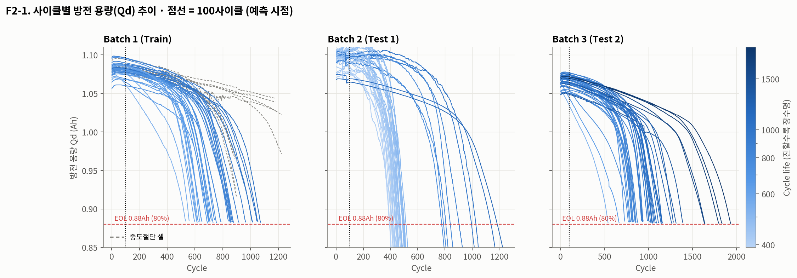
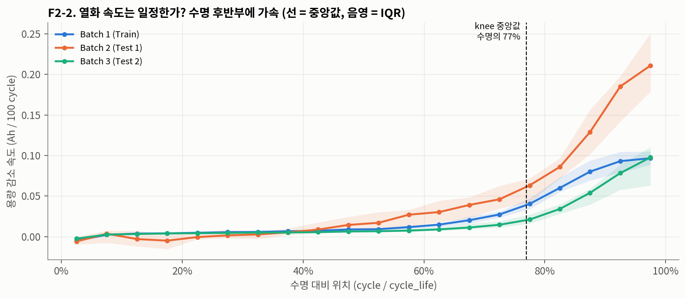
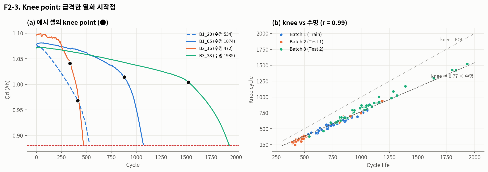
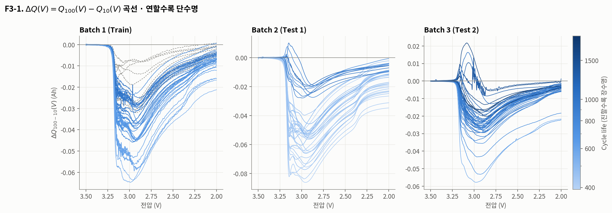
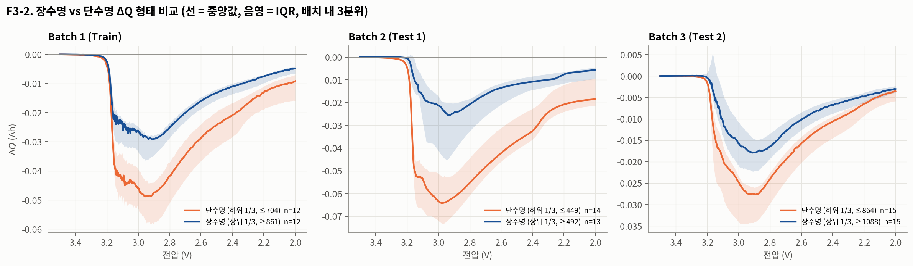

# DAY 1 · 모델 전략 수립 · EDA Q1 ~ Q3 (작성: 심혁)

| 항목 | 내용 |
|---|---|
| 데이터 | Batch 1 `2017-05-12` (Train) · Batch 2 `2018-02-20` (Test 1) · Batch 3 `2018-04-12` (Test 2) |
| 공통 전처리 | cycle 1 제거 (전 컬럼 0으로 기록) · `cycle_life` 결측 셀 제외 (B2 8셀, B3 2셀) · Qd 범위 밖 값(0.5~1.3Ah 밖) 제거 후 rolling median(11) |
| 분석 셀 수 | B1 46 · B2 39 · B3 44 (B1 중 10셀은 중도절단, 아래 Q1-3 참고) |
| 표기 | 시사점마다 ID(I1, I2 …)를 붙이고 마지막 "모델 설계 전략 연결"에서 그대로 인용 |

---

## 📌 한눈에 보기

| 질문 | 확인한 핵심 | 근거 | 시사점 |
|---|---|---|---|
| Q1-1 분포 | 배치마다 분포 위치가 다름. B2 중앙값 472, B1 858, B3 1,006 | F1-1 | I1, I3 |
| Q1-2 비율 | 단수명(<500): B1 0% · B2 72% · B3 0% / 장수명(>1000): 22% · 8% · 52% | F1-2 | I2, I3 |
| Q1-3 이상치 | B2 이상치 9셀은 전부 `newstructure` (같은 정책 대비 수명 ×1.6~2.2). B1 10셀은 EOL 전에 기록 종료 | F1-3, F1-4 | I10, I13 |
| Q2-1 Qd 추이 | 평평하다가 급락하는 비선형 곡선. 100사이클 시점 용량으로는 수명 구분 안 됨 (r 0.35) | F2-1, F2-4 | I4 |
| Q2-2 열화 속도 | 일정하지 않음. 수명 마지막 20% 구간 속도가 전체 평균의 약 3.4배 | F2-2 | I14 |
| Q2-3 Knee | knee ≈ 수명의 75~79%, knee와 수명 r = 0.99 (세 배치 공통) | F2-3 | I14, I15 |
| Q3-1 ΔQ 계산 | `Qdlin[99] - Qdlin[9]` (칸 번호 = 사이클 - 1), 129셀 × 1,000포인트 | F3-1 | |
| Q3-2 형태 비교 | 단수명일수록 2.9~3.0V 골이 깊음 (최저점 1.5~2.5배). log var(ΔQ)와 수명 r = -0.76 ~ -0.92 | F3-2, F3-3 | I5, I12 |

---

## Q1. Cycle Life 분포는 어떻게 생겼는가?

### Q1-1. 150 ~ 2,300 사이클 Histogram


| 통계량 | B1 (Train) | B1 EOL 도달만 | B2 (Test 1) | B3 (Test 2) |
|---|---|---|---|---|
| n | 46 | 36 | 39 | 44 |
| min ~ max | 534 ~ 1,227 | 534 ~ 1,074 | 392 ~ 1,186 | 541 ~ 1,935 |
| 중앙값 / 평균 | 858 / 845 | 773 / 788 | 472 / 566 | 1,006 / 1,060 |
| 표준편차 · CV | 185 · 0.22 | 149 · 0.19 | 222 · 0.39 | 314 · 0.30 |
| IQR | 211 | 191 | 69 | 327 |
| 왜도 / 첨도 | 0.45 / -0.48 | 0.30 / -0.81 | 1.64 / 1.45 | 1.26 / 1.33 |

- 같은 실험 계열인데도 분포가 놓인 위치 자체가 달랐다. B2는 B1 학습 범위(회색) 왼쪽 바깥에 몰려 있고, B3는 오른쪽 꼬리(1,300 ~ 1,935)가 범위를 넘어간다.
- B2는 평균(566)과 중앙값(472) 차이가 크고 IQR은 69로 아주 좁다. 대부분은 400대에 몰려 있는데 소수 셀이 800 ~ 1,200에 따로 떨어져 있는 쌍봉 형태였다.
- B3는 왜도 1.26으로 오른쪽 꼬리가 길다. B1은 상대적으로 대칭에 가깝다.

### Q1-2. 장수명(>1,000) / 단수명(<500) 비율



| | 단수명 < 500 | 중간 | 장수명 > 1,000 | 참고: 550 미만 셀 수 |
|---|---|---|---|---|
| B1 | 0% | 78% | 22% | 1 / 46 |
| B2 | 72% | 21% | 8% | 30 / 39 |
| B3 | 0% | 48% | 52% | 1 / 44 |

- 학습용 B1에는 단수명 셀이 하나도 없고, B2는 반대로 단수명이 대부분이다. 처음엔 "학습/테스트를 잘 섞어둔 데이터"일 줄 알았는데 오히려 정반대였다.
- 논문 분류 기준(550)으로 잘라보면 B1에서 단수명 클래스가 1셀뿐이다. 이 상태로는 분류 모델을 학습시킬 수가 없다.

### Q1-3. 이상치 셀 식별, 왜 유독 짧은가?


| 배치 | IQR 기준 이상치 | 정체 |
|---|---|---|
| B1 | 없음 (기준 387 ~ 1,231) | 대신 EOL 미도달로 기록이 끝난 중도절단 셀 10개 발견 (▲) |
| B2 | 9셀 (777 ~ 1,186) | 9셀 전부 `-newstructure` 정책. 같은 충전 정책의 기존 구조 셀보다 ×1.6 ~ 2.2 오래 감 |
| B3 | 3셀 (1,801 / 1,836 / 1,935) | 4.8C(80%)-4.8C, 5C(67%)-4C. 초기 온도·충전시간은 배치 평균 수준이라 이것만으로는 설명 안 됨 |

B2 이상치는 "이상한 셀"이 아니라 다른 실험 구조 그룹이 섞여 있던 거였다. B1에는 `newstructure` 셀이 0개, B3는 전부라서 학습 데이터에는 이 효과가 아예 없다.


| 배치 | 가장 짧은 셀 (수명) | 공통점 |
|---|---|---|
| B1 | 5.4C(80%)-5.4C (534, 559) · 8C(35%)-3.6C (599, 616) · 7C(40%)-3.6C (617) | 80%까지 평균 4.7 ~ 5.4C로 빠르게 충전 |
| B2 | 6C(60%)-3C (392, 408) · 3.6C(9%)-5C (393, 396) · 5.6C(26%)-4.5C (412) | 전부 기존 구조(newstructure 아님) |
| B3 | 3.7C(31%)-5.9C (541, 667, 772) · 5.9C(60%)-3.1C (731) | 2단계 전류(C2)가 5.9C로 높은 정책 |

- 왜 짧은지는 B1에서 제일 잘 보였다. 0→80% 평균 충전 속도가 빠를수록 수명이 짧았고(r = -0.58), 수명 하위 5셀은 상위 5셀보다 초기 100사이클 최고온도가 약 0.9°C 높았다. 빠른 충전 → 발열 → 열화 가속이라는 도메인 설명과 맞는 방향이다.
- B2·B3는 모든 정책이 80%까지 약 10분(평균 4.8C)으로 설계돼 있어서 평균 속도로는 비교가 안 됐다. 대신 전류를 어느 구간에 몰았는지(C1, Q1, C2)가 달랐다. 이 부분은 Q4에서 이어서 본다.

#### 데이터 품질: B1 수명 중도절단 (I13)

| 셀 | cycle_life | 마지막 용량 | 정책 |
|---|---|---|---|
| B1_00 ~ 02 | 1,177 ~ 1,190 | 1.03 ~ 1.04 Ah | 3.6C(80%)-3.6C |
| B1_03, 04 | 1,226, 1,227 | 0.97, 1.02 Ah | 4C(80%)-4C |
| B1_08, 10, 12, 13, 22 | 879 ~ 906 | 0.92 ~ 0.97 Ah | 5.4C / 6C 계열 |

열화 곡선(F2-1 회색 점선)을 그리다가 발견했다. 이 10셀은 EOL(0.88Ah)에 닿기 전에 기록이 끝났고 `cycle_life`에는 "기록이 끝난 사이클"이 들어 있다. 실제 수명은 이보다 길다. 빼면 B1 범위가 534 ~ 1,074로 더 좁아진다.

#### 추가 확인: log 변환



| | B1 | B2 | B3 |
|---|---|---|---|
| 왜도 (원래) | 0.45 | 1.64 | 1.26 |
| 왜도 (log) | 0.04 | 1.36 | 0.52 |

log를 취하니 B1·B3는 거의 대칭이 됐다. B2는 쌍봉이라 log로도 풀리지 않았다.

### Q1 시사점

| ID | 확인한 사실 | 모델 설계에 반영 |
|---|---|---|
| I1 | 오른쪽 꼬리 분포, log 시 B1·B3 대칭 | Target = `log(cycle_life)` |
| I2 | 550 기준 B1 단수명 1셀 | 분류는 학습 불가 → **회귀 선택** |
| I3 | B2 대부분이 B1 최솟값 아래, B3 꼬리가 B1 최댓값 위 | 범위 밖 예측(외삽)이 가능한 선형 계열 우선 |
| I10 | `newstructure`가 수명 ×1.6 ~ 2.2, B1에는 없음 | 정책 이름 대신 실제 열화 신호 피처 중심 |
| I11 | B2·B3는 평균 충전 속도가 사실상 상수(4.8C) | 평균 C-rate·충전시간은 테스트에서 변별력 없음 → 제외 검토 |
| I13 | B1 10셀 중도절단 | 학습 시 제외(36셀)를 기본으로, 포함한 경우와 비교 |
| I9 | B2 8셀(VarCharge·SLOWCYCLE), B3 2셀(2,189·2,237사이클에도 EOL 미도달) 제외 | B3 장수명 끝단이 덜 반영된 한계 명시 |

---

## Q2. 열화 곡선, 방전 용량은 어떻게 감소하는가?

### Q2-1. 사이클별 Qd 추이



- 세 배치 모두 1.05 ~ 1.10Ah에서 시작해서 한동안 거의 평평하게 가다가 어느 시점부터 급하게 떨어진다. 일직선으로 줄어드는 게 아니었다.
- 배치마다 시작 용량도 달랐다. B2는 1.09 ~ 1.10Ah로 높게 시작하는데 가장 빨리 죽고, B3는 1.05 ~ 1.07Ah로 낮게 시작해서 가장 오래 간다.


| | B1 | B2 | B3 |
|---|---|---|---|
| SOH@100 vs log(수명) 상관 | 0.35 | -0.28 | 0.34 |

- 예측 시점인 100사이클까지 확대해보면 단수명(주황)과 장수명(남색)이 뒤섞여 있다. 상관도 약하고 B2는 방향까지 반대다. "초기 용량 숫자"만으로는 수명을 못 맞힌다는 게 이 데이터의 출발점이라는 걸 직접 확인했다.

### Q2-2. 열화 속도가 일정한가, 가속되는가?



| (Ah / 100 cycle, 중앙값) | B1 | B2 | B3 |
|---|---|---|---|
| 초반 50% 구간 속도 | 0.004 | 0.003 | 0.004 |
| 마지막 20% 구간 속도 | 0.084 | 0.156 | 0.065 |
| 마지막 20% / 초반 | ×19 | ×23 | ×16 |
| 마지막 20% / 전체 평균 | ×3.3 | ×3.5 | ×3.4 |

- 수명 대비 위치로 정규화하니 세 배치 모양이 거의 같았다. 수명의 60%까지는 0.005Ah/100cycle 안팎으로 거의 일정하고, 그 뒤로 급격히 가속된다.
- 가속 정도는 B2가 가장 크다(마지막 20% 구간 0.156). 같은 "수명 대비 위치"라도 B2는 훨씬 가파르게 무너진다.

### Q2-3. Knee point 탐색



| | B1 (n=36) | B2 (n=39) | B3 (n=44) |
|---|---|---|---|
| knee 사이클 (중앙값) | 577 | 342 | 820 |
| knee / 수명 | 0.75 | 0.75 | 0.79 |

- 방법: EOL까지의 곡선에 직선 두 개를 맞추고, 두 직선 오차 합이 가장 작은 꺾임 위치를 knee로 잡았다 (중도절단 셀 제외).
- knee는 배치와 상관없이 수명의 약 75 ~ 79% 지점에서 나왔고 knee와 수명의 상관이 0.99였다. 배치가 달라도 "언제 꺾이는지의 비율"은 거의 같다는 게 흥미로웠다.
- 다만 knee는 100사이클 이후 데이터로 계산되는 값이라 예측 피처로 쓰면 누수다. 해석용으로만 쓴다.

### Q2 시사점

| ID | 확인한 사실 | 모델 설계에 반영 |
|---|---|---|
| I4 | 100사이클 용량과 수명 상관 약함 (0.35, -0.28, 0.34) | 용량 원값 대신 곡선 모양 기반 피처(ΔQ) 중심 |
| I14 | 열화는 비선형, knee ≈ 수명의 75%, 이후 약 3.4배 가속 | 초기 신호로 knee 시점을 미리 맞히는 문제. 운영 관점에서는 knee 전에 교체 계획 필요 |
| I15 | knee, 가속비, 후반 열화 속도는 100사이클 이후 정보 | 피처에서 제외 (누수 방지), EDA 설명용으로만 사용 |

---

## Q3. ΔQ(V) 곡선, 초기 사이클에서 차이가 보이는가?

### Q3-1. 사이클 100 - 사이클 10의 Q(V) 차이 계산

```python
# Qdlin: 방전 용량을 전압축 3.5V → 2.0V, 1,000포인트로 보간한 값
# cycles 배열은 0부터, 사이클 번호는 1부터 → cycle k = 인덱스 k-1
dQ = Qdlin[99] - Qdlin[9]          # ΔQ(V) = Q100(V) - Q10(V)
```

- 처음에 `Qdlin[100] - Qdlin[10]`으로 계산할 뻔했다. summary의 QDischarge와 cycles의 Qd 최댓값을 줄 단위로 맞춰보고 세 배치 모두 "인덱스 = 사이클 - 1"인 걸 확인했다. B1은 인덱스 0(사이클 1)이 비어 있었다.
- 129셀 전부 1,000포인트로 정상 추출됐다.



- 세 배치 모두 3.2V 근처에서 아래로 꺼지고 2.9 ~ 3.0V에서 가장 깊어졌다가 2.0V 쪽으로 가며 0에 가까워진다.
- 색이 연할수록(단수명) 골이 깊다. B1 중도절단 셀(회색 점선)은 골이 가장 얕았는데, 실제로 가장 오래 가는 셀들이라 앞뒤가 맞는다.

### Q3-2. 장수명 셀 vs 단수명 셀의 ΔQ 형태 비교



| 배치 내 3분위 비교 | 단수명 최저점 | 장수명 최저점 | 깊이 비 | 곡선 아래 면적 비 |
|---|---|---|---|---|
| B1 | -0.049 Ah (2.95V) | -0.029 Ah (2.91V) | ×1.7 | ×1.7 |
| B2 | -0.064 Ah (2.98V) | -0.026 Ah (2.94V) | ×2.5 | ×2.9 |
| B3 | -0.028 Ah (2.89V) | -0.018 Ah (2.91V) | ×1.5 | ×1.6 |

- 모양(골이 생기는 전압 위치)은 장수명/단수명이 거의 같고, 차이는 골의 깊이와 폭이었다. Q2에서는 100사이클 용량이 비슷해 보였는데 전압별로 쪼개 보면 이미 이때부터 차이가 크게 벌어져 있었다.
- 배치마다 절대 크기는 달랐다. B3는 단수명 셀도 -0.028 수준이라 B1·B2보다 전체적으로 얕다.


| 요약 통계량 vs log(수명) | B1 | B2 | B3 |
|---|---|---|---|
| log10 var(ΔQ) | -0.84 (중도절단 포함 -0.87) | -0.92 | -0.76 |
| log10 \|min(ΔQ)\| | -0.82 | -0.90 | -0.74 |
| B1 직선 대비 오차 중앙값 | -1% | **-24%** | -2% (장수명 쪽 최대 +70%) |

- 곡선의 흔들림을 숫자 하나(log var)로 줄여도 세 배치 모두 강한 음의 상관이 유지됐다. Q2의 용량값(0.35)과 비교하면 차이가 확실하다.
- B1으로 맞춘 직선에 다른 배치를 대보니 B2 점들이 전체적으로 아래에 있었다. 같은 ΔQ 값이라도 B2 수명이 약 24% 짧다는 뜻이라 B1만으로 학습하면 B2는 길게(과대) 예측할 가능성이 크다. B3는 중앙값은 맞는데 1,500 이상 장수명 셀에서 크게 빗나갔다.

### Q3 시사점

| ID | 확인한 사실 | 모델 설계에 반영 |
|---|---|---|
| I5 | ΔQ 흔들림이 클수록 단수명, 세 배치 모두 r = -0.76 ~ -0.92 | 핵심 피처. log var(ΔQ) 단일 피처 회귀를 baseline으로 |
| I7 | log var와 log \|min\|은 거의 같은 정보 (같은 곡선의 다른 요약) | 둘 중 하나만 쓰거나 정규화 모델로 처리 (VIF는 Q5에서 확인) |
| I12 | 배치마다 ΔQ-수명 기준선이 다름 (B2 -24%, B3 장수명 쪽 오차 큼) | 성능은 B2·B3 따로 보고, 부호 있는 오차(bias)까지 확인 |

(Q3의 ③ 통계값 피처 추출, Q4, Q5는 지원 작성)

---

## ➡️ Q1 ~ Q3에서 나온 모델 설계 전략 연결

### 1. Feature Engineering

| 구분 | 변수 | 근거 |
|---|---|---|
| 핵심 후보 | log10 var(ΔQ₁₀₀₋₁₀) 또는 log10 \|min(ΔQ)\| 중 하나 | I5, I7 |
| 보조 후보 | 2 ~ 100사이클 Qd 감소 기울기, 91 ~ 100 기울기 | I4 (원값 대신 변화량) |
| 조건부 | C1, Q1, C2 (정책 문자열 파싱) | I10 (정책명 자체는 B1↔B3 겹침 없음) |
| 제외 | knee, 가속비, 후반 열화 속도 | I15 (100사이클 이후 정보) |
| 제외 검토 | 평균 C-rate, 초기 충전시간 | I11 (B2·B3에서 거의 상수) |

### 2. Regression vs Classification

| | 회귀 (선택) | 분류 (550 기준) |
|---|---|---|
| 학습 데이터 상태 | B1 36 ~ 46셀 모두 사용 가능 | B1 단수명 클래스 1셀 → 학습 불가 (I2) |
| 테스트와의 관계 | 범위 밖 수명도 선형 모델로 외삽 가능 (I3) | B2는 77%가 단수명이라 학습/테스트 클래스 비율이 정반대 |
| 비즈니스 연결 | 남은 수명(RUL) → ESS 교체 시점 계획 | 합격/불합격 스크리닝 |

**Target = `log(cycle_life)`** (I1). 오른쪽 꼬리가 줄고, 오차가 "몇 % 틀렸나"로 해석돼서 MAPE와도 잘 맞는다.

### 3. Modeling Strategy

| 단계 | 전략 | 근거 |
|---|---|---|
| 데이터 처리 | cycle 1 제거, 결측 셀 제외, B1 중도절단 10셀 제외(36셀) 기본 + 포함 버전 비교 | I9, I13 |
| 검증 | B1 안에서 Repeated K-Fold (셀 단위), 스케일러는 Pipeline 안에서 fit | 셀 수가 적음 (I13 이후 36셀) |
| 최종 평가 | B2, B3 각각 한 번씩. RMSE · MAPE(논문 9.1%와 비교) · 부호 있는 오차 | I12 |

| 후보 모델 | 왜 고르는지 (EDA 연결) |
|---|---|
| M0. 평균 예측 (Dummy) | 비교 기준선 |
| M1. log var(ΔQ) 단일 피처 선형회귀 | I5. 피처 하나로 세 배치 r -0.76 ~ -0.92 → 이것만으로 어디까지 되는지 확인 |
| M2. ElasticNet (ΔQ + 기울기 + 정책 피처) | I3 외삽 가능, I7 비슷한 피처끼리 겹침, 셀 수 적음 → 정규화 선형 모델 |
| M3. RandomForest / XGBoost (비교용) | 비선형 관계 확인용. 다만 I3 때문에 B1 범위(최대 1,074) 밖의 B3 장수명은 못 맞힐 것으로 예상 → 이 예상을 검증하는 실험 |

---

## 시사점 ID 목록 (지원 파트 연결용)

| ID | 출처 | 한 줄 요약 |
|---|---|---|
| I1 | Q1 | Target = log(cycle_life) |
| I2 | Q1 | 550 기준 B1 단수명 1셀 → 회귀 |
| I3 | Q1 | B2·B3가 B1 범위 밖 → 외삽 가능한 선형 계열 |
| I4 | Q2 | 100사이클 용량은 정보 부족 → 곡선 기반 피처 |
| I5 | Q3 | log var(ΔQ) 세 배치 모두 강한 상관 → 핵심 피처 |
| I7 | Q3 | ΔQ 요약값끼리 정보 중복 → 하나만 또는 정규화 |
| I9 | Q1 | 결측 셀 제외, B3 장수명 끝단 한계 |
| I10 | Q1 | newstructure 효과, B1에 없음 |
| I11 | Q1 | B2·B3 평균 충전 속도 상수 → 변별력 없음 |
| I12 | Q3 | 배치별 기준선 차이 → 배치별 성능·bias 보고 |
| I13 | Q1 | B1 10셀 중도절단 → 제외 기본 |
| I14 | Q2 | 열화 비선형, knee ≈ 수명의 75% |
| I15 | Q2 | knee 등 사후 정보는 피처 제외 |
